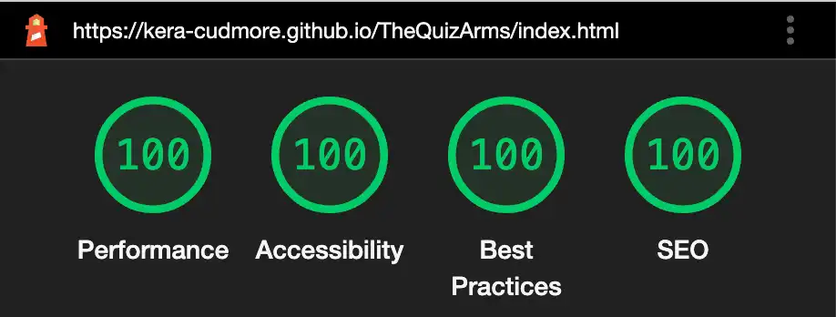
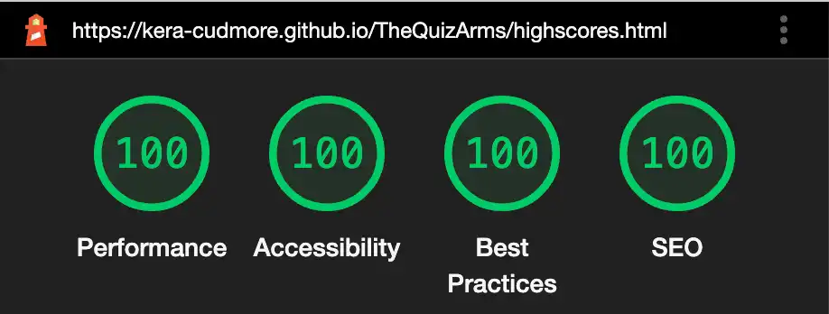
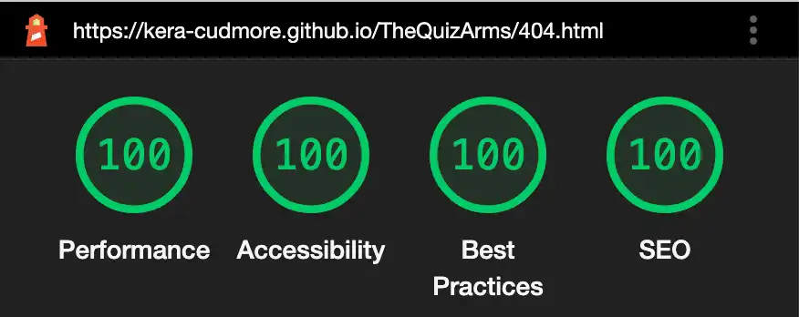
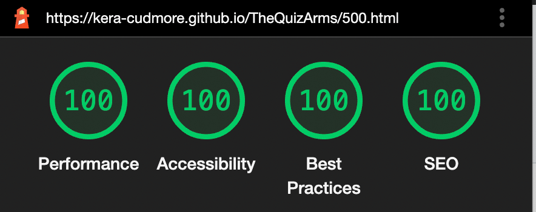
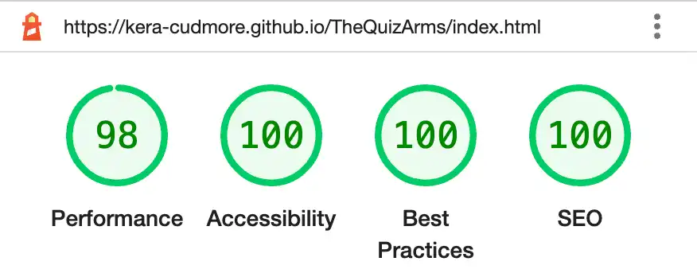
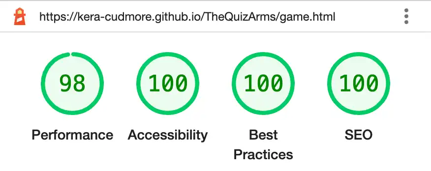
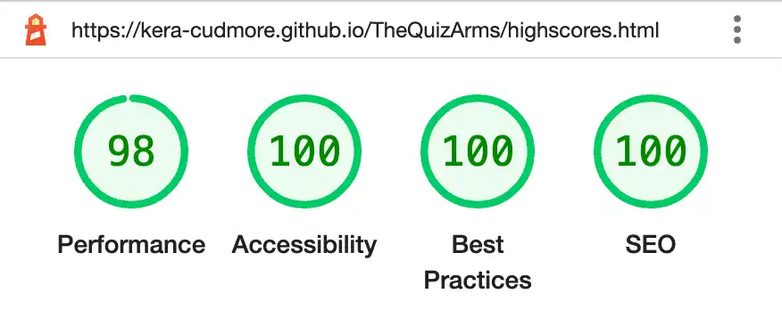
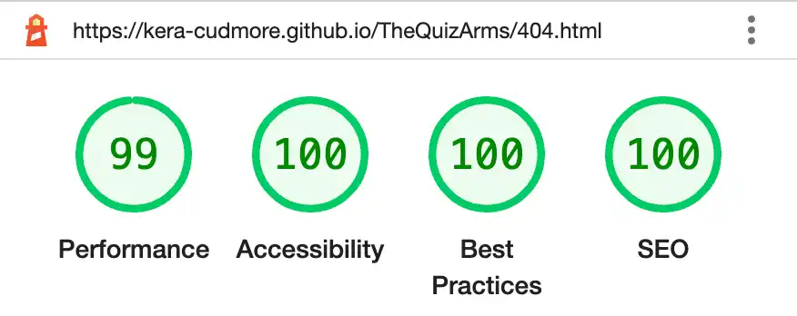
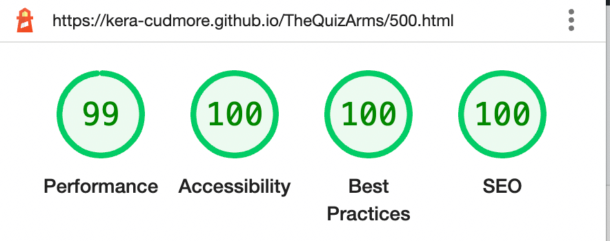

# **The Quiz Arms Testing**

* [W3C Validator](#W3C-Validator)
* [JavaScript Validator](#JavaScript-Validator)
* [Testing User Stories](#Testing-User-Stories)
* [Lighthouse](#Lighthouse)
* [Full Testing](#Full-Testing)

Testing was ongoing throughout the entire build. I utilised Chrome developer tools whilst building to pinpoint and troubleshoot any issues as I went along.

During development I made use of google developer tools to ensure everything was working correctly and to assist with troubleshooting when things were not working as expected.

I utilised the console in the developer tools to work through small sections of JavaScript and ensure that the code was working, and also to troubleshoot where issues were.

I have gone through each page using google chrome developer tools & Firefox inspector tool to ensure that each page is responsive on a variety of different screen sizes and devices.

To fully test my website I performed the following testing using a number of browsers (google chrome, Firefox & Safari) and devices (Macbook Pro 14 inch, iPhone X, iPhone 11 pro, iPhone 13 pro). Friends and family have also tested the site on their own devices.

- - -

## **W3C VALIDATOR**

[W3C](https://validator.w3.org/) was used to validate the HTML on all pages of the website. It was also used to validate the CSS.

* [index.html](testing/w3/w3-index.png) - Passed.
* [game.html](testing/w3/w3-game.png) - No errors, 1 Warning. The warning is for an empty H2 tag. This is where the question is inserted using jQuery.
* [highscores.html](testing/w3/w3-highscores.png) - Passed.
* [404.html](testing/w3/w3-404.png) - Passed.
* [500.html](testing/w3/w3-500.png) - Passed.

* [style.css](testing/w3/w3-css.png) - Passed, no errors found.

- - -

## **JAVASCRIPT VALIDATOR**

[jshint](https://jshint.com/) was used to validate the JavaScript.

* [javascript.js](testing/jshint/jshint-javascript.png) - Passed.
* [game.js](testing/jshint/jshint-game.png) - Passed with one warning. Async functions are only available in ES8. It also stated that there are 4 unused variables, however these are being used.
* [highscores.js](testing/jshint/jshint-highscores.png) - Passed.

- - -

## **TESTING USER STORIES**

    - First Time Visitors

| Goals | How are they achieved? |
| :--- | :--- |
| I want to take part in a pub quiz online and improve my general knowledge. I want to be able to play at any time, anywhere. | The Quiz Arms pulls general knowledge quiz questions from a large variety of topics, much like a pub quiz would do. The site is available for use whenever is convenient to the user. |
| I want the site to be responsive to my device. | I have developed the site with responsiveness in mind. |
| I want the site to be easy to navigate. | Buttons are used throughout the site for navigation, much like a mobile app. As the site is like a mobile app - I decided that I didn't want to add a navigation bar or footer, as these would make the site look more like a traditional webpage. The page title also acts as a link to the home page.  |

    - Returning Visitors
|  Goals | How are they achieved? |
| :--- | :--- |
| I want to be able to choose a level of difficulty that I feel is appropriate for me, based on my experience from my first visit to the site. | Users are able to select their own level of difficulty before the game begins. Once they have played they are free to select a different level of difficulty for subsequent games. |

    - Frequent Visitors
| Goals | How are they achieved? |
| :--- | :--- |
| I want to be able to adjust the difficulty level to keep improving my knowledge. | Users are able to select their own level of difficulty before the game begins. Once they have played they are free to select a different level of difficulty for subsequent games. |
| I want to be able to log my high scores to see how I am performing. | Users of the site are able to log their high scores to the high scores page. The top ten results will be displayed. |

- - -

## **Lighthouse**

I used Lighthouse within the Chrome Developer Tools to test the performance, accessibility, best practices and SEO of the website.

### Desktop Results

All pages of the site are achieving a score of 100 across the 4 categories.

### Mobile Results

Each page is achieving a score of 100 for the last three categories. The performance category is achieving a score of 98 for the first three pages and a score of 99 on the 404 & 500 page.

- - -

## **Full Testing**

`Home Page`
| Feature | Expected Outcome | Testing Performed | Result | Pass/Fail |
| --- | --- | --- | --- | --- |
| The Sites title | Link directs the user back to the home page | Clicked title | Home page reloads | Pass |
| How to play button | Displays the modal with the instructions on how to play the game | Clicked on button | Modal with instructions on how to play opens | Pass |
| Modal close button | Closes the modal | Clicked on close button | Modal closed | Pass |
| Play Button | Directs the user to the game page | Clicked on button | Game page opens to display the difficulty selections | Pass |
| High Scores Button | Directs the user to the high scores page | Clicked on button | Directs to the high scores page | Pass |
| All buttons - hover effect | All black buttons with white text should change colour to white with black text when hovered over | Hover over each button on the page | Each button displayed the correct styling when hovered over | Pass |
| 🍺 Cursor | The 🍺 should display when a user moves the mouse over a button | Moved the mouse over each button to check the cursor changed upon entering the button | The cursor changed from the ↖ cursor to the 🍺 cursor | Pass |

`Game Page - Difficulty Selection`
| Feature | Expected Outcome | Testing Performed | Result | Pass/Fail |
| --- | --- | --- | --- | --- |

`Game Page - Quiz Area`
| Feature | Expected Outcome | Testing Performed | Result | Pass/Fail |
| --- | --- | --- | --- | --- |

`Game Page - End of Quiz`
| Feature | Expected Outcome | Testing Performed | Result | Pass/Fail |
| --- | --- | --- | --- | --- |

`High Scores Page`
| Feature | Expected Outcome | Testing Performed | Result | Pass/Fail |
| --- | --- | --- | --- | --- |

`404 Error Page`
| Feature | Expected Outcome | Testing Performed | Result | Pass/Fail |
| --- | --- | --- | --- | --- |

`500 Error Page`
| Feature | Expected Outcome | Testing Performed | Result | Pass/Fail |
| --- | --- | --- | --- | --- |

